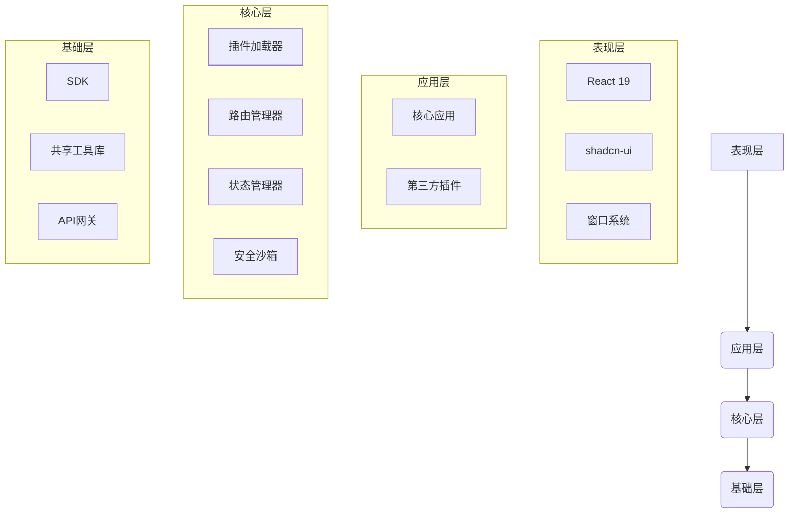

# 玲珑OS项目总体设计

## 1. 项目概览

### 1.1 项目背景
在当前的Web技术浪潮中，用户对浏览器内的应用体验要求越来越高。传统的网页应用在多任务处理、窗口管理和沉浸式体验方面存在局限。为了打破这些束缚，我们启动了“玲珑OS”项目，旨在构建一个功能完备、高度可扩展的Web桌面操作系统。它不仅是对现有Web应用形态的一次革新，更是对未来浏览器作为“操作系统”理念的一次大胆探索。

### 1.2 项目目标
- **构建一个现代化的Web桌面环境**：提供媲美原生操作系统的流畅、直观的用户体验，支持窗口化、多任务、虚拟桌面等高级功能。
- **实现高度可扩展的插件化架构**：打造一个开放的生态系统，允许第三方开发者通过插件轻松创建和集成新功能，丰富系统的应用场景。
- **确保系统的安全性和稳定性**：通过多层沙箱机制、严格的权限控制和精细的资源管理，全面保护用户数据和系统稳定。
- **提供完善的开发工具和文档**：降低开发者的学习曲线，提供从开发、调试到发布的全链路支持，促进社区生态的繁荣。

### 1.3 业务价值
- **提升用户体验**：为用户提供一个统一、高效的Web工作环境，打破浏览器标签页的限制，提升多任务处理能力。
- **赋能开发者**：通过强大的插件化能力和完善的开发支持，帮助开发者快速构建功能丰富的Web应用，降低开发成本。
- **抢占技术高地**：在Web操作系统这一前沿领域进行探索和布局，积累核心技术，为公司在下一代Web技术竞争中赢得先机。

## 2. 技术架构

### 2.1 整体架构
玲珑OS采用先进的微内核与插件化思想，构建了一个分层、解耦的系统架构。



- **表现层**：负责用户界面的渲染和交互，采用React 19和shadcn-ui组件库，构建了高效的窗口系统。
- **应用层**：包括系统的核心应用（如窗口管理器、任务栏）和第三方开发的插件，共同构成了丰富的应用生态。
- **核心层**：提供系统运行的核心服务，如插件加载、路由管理、状态管理和安全沙箱，确保系统的稳定和安全。
- **基础层**：为上层提供基础支持，包括供插件开发者使用的SDK、共享工具函数库和统一的API网关。

### 2.2 模块划分与功能边界
| 模块 | 功能描述 | 交互关系 |
| :--- | :--- | :--- |
| **前端宿主 (Host)** | 承载所有插件和应用的前端环境，包含窗口管理器、桌面、任务栏等核心UI组件。 | 与插件加载器交互，动态加载和渲染插件；通过API网关与后端通信。 |
| **后端服务 (Server)** | 提供支持系统运行的后端服务，包括API网关、插件注册中心、用户认证等。 | 为前端宿主和插件提供数据支持和业务逻辑处理。 |
| **软件开发工具包 (SDK)** | 为插件开发者提供的工具包，封装了与系统核心交互的API和常用工具函数。 | 插件通过SDK与核心层通信，调用系统服务。 |
| **共享UI库 (UI)** | 包含可在多个插件和核心应用之间共享的React组件，确保系统UI的一致性。 | 被前端宿主和各个插件作为依赖项使用。 |
| **共享工具库 (Shared)** | 提供跨项目的共享工具函数、类型定义和常量。 | 被所有其他模块作为依赖项使用。 |

### 2.3 技术栈
- **UI框架**：React 19
- **构建工具**：Rsbuild
- **组件库**：shadcn-ui
- **状态管理**：Zustand
- **路由管理**：React Router
- **测试框架**：Rstest
- **后端框架**：Egg.js
- **数据库**：SQLite
- **ORM**：Sequelize
- **包管理器**：pnpm
- **Monorepo工具**：Turborepo
- **代码格式化/Linter**：Biome
- **类型检查**：TypeScript (Strict Mode)

## 3. 开发路线图与里程碑

### 3.1 开发阶段
| 阶段 | 时间 | 主要任务 |
| :--- | :--- | :--- |
| **阶段一** | 1-2周 | **基础架构搭建**：完成项目初始化、Turborepo配置，设计并实现核心技术架构。 |
| **阶段二** | 3-5周 | **核心功能开发**：开发SDK、前端宿主、窗口管理器、插件加载器等核心模块。 |
| **阶段三** | 6-8周 | **应用生态建设**：开发桌面系统、任务栏、文件管理器等核心应用，完善开发者文档。 |
| **阶段四** | 9-10周 | **系统优化与测试**：进行全面的测试、性能优化和部署流程优化。 |

### 3.2 里程碑
- **第一周**：完成项目初始化和基础架构设计。
- **第三周**：发布第一个可用版本的SDK。
- **第五周**：完成核心功能开发，系统具备基本运行能力。
- **第八周**：完成核心应用开发，系统功能基本完善。
- **第十周**：完成所有测试和优化，准备正式发布。

## 4. 项目初始化

### 4.1 环境准备
- Node.js >= 18.0.0
- pnpm >= 8.0.0

### 4.2 项目结构
```
/
├── apps
│   ├── host (前端宿主应用)
│   └── server (后端服务)
├── packages
│   ├── sdk (提供给插件开发者的SDK)
│   ├── shared (共享工具、类型定义)
│   └── ui (共享UI组件)
├── package.json
├── pnpm-workspace.yaml
└── turbo.json
```

### 4.3 初始化步骤
1. **克隆项目仓库**
   ```bash
   git clone <repository_url>
   ```
2. **安装依赖**
   ```bash
   pnpm install
   ```
3. **启动开发环境**
   ```bash
  pnpm dev
   ```
```

---

## 5. 文档元数据

- **文档类型**: 项目总体设计
- **关键词**: 玲珑OS, Web桌面, 总体设计, 项目背景, 业务价值, 系统架构, 模块划分, 技术栈, 开发路线图
- **目标读者**: 项目经理, 架构师, 核心开发者
- **核心内容**: 本文档旨在从宏观层面描绘玲珑OS项目的全貌，定义其核心目标、价值、架构设计和发展蓝图，是整个项目的纲领性文件。
- **AI解析优化**: 
  - 使用Markdown的`mermaid`语法绘制架构图，便于AI解析和渲染。
  - 采用表格形式清晰地展示模块划分和开发路线图。
  - 标题层级分明，结构清晰，有助于AI理解文档结构。
  - 关键术语（如“Web桌面”、“插件化”）在文档中有明确定义或上下文解释。