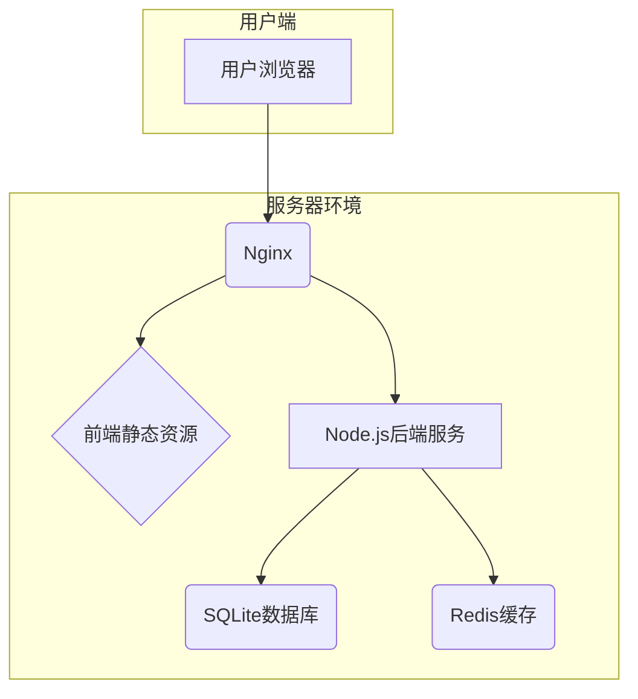

# 玲珑OS基础架构与核心设计

## 1. 基础架构设计

### 1.1 分层架构
玲珑OS采用经典的四层架构，以实现高内聚、低耦合的设计目标。

- **表现层 (Presentation Layer)**：负责UI渲染和用户交互。主要技术包括React、DOM、CSS等。
- **应用层 (Application Layer)**：包含系统的核心应用和第三方插件。应用之间通过事件总线或API进行通信。
- **核心层 (Core Layer)**：提供系统的核心能力，如窗口管理、插件管理、路由、状态管理等。这是系统的核心，为上层应用提供稳定可靠的服务。
- **基础层 (Infrastructure Layer)**：提供通用的技术支持，如SDK、工具库、安全沙箱、通信模块等。

### 1.2 安全架构
安全是玲珑OS设计的重中之重。我们采用多层次的安全策略来确保系统和用户数据的安全。

#### 1.2.1 插件沙箱
所有第三方插件都将在沙箱环境中运行，以隔离其对系统资源的访问。
- **iframe沙箱**：对于UI类插件，我们将使用`iframe`进行隔离，并设置严格的`sandbox`属性。
- **Worker沙箱**：对于无UI的后台任务插件，我们将使用`Worker`或`worker_threads`（如果环境支持）来运行，以隔离其执行环境。

#### 1.2.2 权限控制
系统将实施一套精细化的权限控制机制。插件需要在其`manifest.json`文件中声明所需的权限，用户在安装插件时需要明确授权。

#### 1.2.3 通信安全
- **跨源通信**：插件与主应用之间的通信将通过`postMessage`进行，并对消息来源进行严格的校验。
- **API调用**：所有敏感的API调用都将经过权限检查。

### 1.3 性能优化
- **代码分割**：按需加载插件和模块，减少首屏加载时间。
- **虚拟化**：对于长列表等场景，使用虚拟化技术（如`react-window`）来提高渲染性能。
- **缓存**：合理利用浏览器缓存和后端缓存，减少网络请求。

## 2. 核心模块设计

### 2.1 窗口管理器
窗口管理器负责所有窗口的创建、销毁、层级管理、状态（最大化、最小化）管理等。
- **状态管理**：使用Zustand来管理所有窗口的状态。
- **窗口组件**：提供一个可拖拽、可缩放、可最大化/最小化的通用窗口组件。

### 2.2 插件加载器
插件加载器负责动态加载和执行插件。
- **插件发现**：从后端API获取插件列表和`manifest`信息。
- **插件加载**：根据插件类型（集成或沙箱）和`manifest`中的定义，使用`SystemJS`或创建`iframe`来加载插件。
- **生命周期管理**：管理插件的安装、卸载、启用、禁用等生命周期事件。

### 2.3 SDK设计
SDK是连接插件和主应用的桥梁。
- **API提供**：向插件暴露一组稳定的API，用于与系统交互（如创建窗口、发送通知等）。
- **环境判断**：SDK内部能够自动判断当前是运行在集成环境还是沙箱环境，并采用不同的通信方式。

## 3. 系统部署与运行环境

### 3.1 部署架构
系统采用前后端分离的部署模式，建议使用Docker容器化部署，并通过Nginx作为反向代理和负载均衡器。



| 组件 | 描述 | 部署建议 |
| :--- | :--- | :--- |
| **Nginx** | 作为反向代理，处理静态资源请求和API请求转发。 | 使用官方Docker镜像，配置SSL证书以启用HTTPS。 |
| **前端静态资源** | React应用构建后的HTML, CSS, JS文件。 | 部署在CDN或Nginx静态文件服务器上，以加速访问。 |
| **Node.js后端服务** | 基于Egg.js的后端应用。 | 使用PM2进行进程管理，或打包成Docker镜像运行。 |
| **SQLite数据库** | 用于存储核心业务数据。 | 数据库文件应挂载到宿主机或持久化存储卷，以防数据丢失。 |
| **Redis缓存** | 用于缓存热点数据和Session信息。 | 使用官方Docker镜像部署。 |

### 3.2 运行环境要求
- **服务端**:
  - Node.js: `^18.0.0`
  - pnpm: `^8.0.0`
  - Redis: `^7.0.0`
- **客户端**:
  - 现代浏览器，支持ES2020+特性（Chrome, Firefox, Safari, Edge最新版）。

## 4. API接口规范与错误处理

### 4.1 接口规范
所有API都应遵循RESTful设计原则，并使用统一的数据格式。

**请求格式**
- **Content-Type**: `application/json`
- **Authorization**: `Bearer <token>` (需要认证的接口)

**响应格式**
```json
{
  "code": 0,
  "message": "Success",
  "data": { ... } // or [ ... ] or null
}
```

| 字段 | 类型 | 描述 |
| :--- | :--- | :--- |
| `code` | Number | 业务状态码，0表示成功，非0表示失败。 |
| `message` | String | 提示信息。 |
| `data` | Object/Array/null | 响应数据。 |

### 4.2 错误代码体系

| Code | Message | HTTP Status | 描述 |
| :--- | :--- | :--- | :--- |
| 0 | Success | 200 | 请求成功 |
| 40001 | Bad Request | 400 | 请求参数错误 |
| 40101 | Unauthorized | 401 | 未授权或Token失效 |
| 40301 | Forbidden | 403 | 无权限访问 |
| 40401 | Not Found | 404 | 请求的资源不存在 |
| 50001 | Internal Server Error | 500 | 服务器内部错误 |
| 50301 | Service Unavailable | 503 | 服务暂时不可用 |

### 4.3 异常处理机制
- **前端**：封装统一的请求函数，根据响应的`code`进行全局的错误提示、重定向等操作。
- **后端**：使用全局异常处理器捕获业务逻辑中的异常，并根据异常类型返回标准格式的错误响应。

---

## 5. 文档元数据

- **文档类型**: 技术架构设计
- **关键词**: 基础架构, 核心设计, 分层架构, 安全架构, 沙箱, 权限控制, 性能优化, 部署架构, API规范, 错误处理
- **目标读者**: 架构师, 核心开发者, 后端开发者
- **核心内容**: 本文档深入阐述了玲珑OS的底层技术架构、核心模块设计、安全策略、部署方案以及API规范，是系统开发和维护的技术基石。
- **AI解析优化**:
  - 使用Mermaid图表清晰地展示部署架构。
  - 使用表格定义API响应格式和错误代码体系，便于AI结构化理解。
  - 对关键技术（如沙箱、分层架构）有详细的文字说明。
  - 提供了清晰的请求和响应JSON示例。