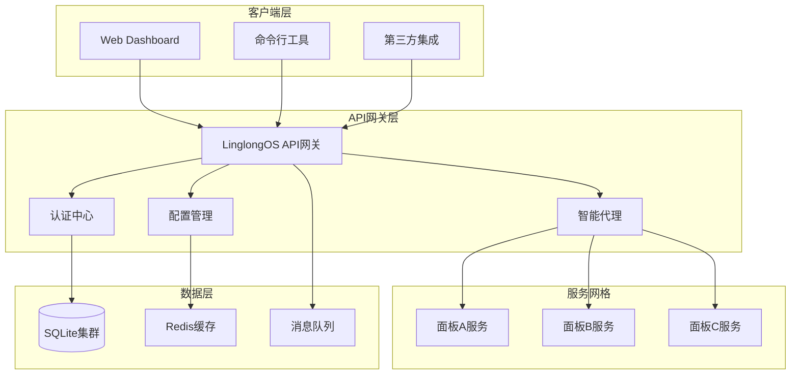

# LinglongOS API 项目全景文档

## 🎯 项目愿景与战略定位

### 核心使命
LinglongOS API 作为下一代操作系统管理中枢，致力于构建**统一、安全、智能**的现代化系统管理生态。我们不仅解决当前系统管理的痛点，更着眼于未来十年的技术演进需求。

### 战略价值
- **数字化转型基石**：为企业数字化转型提供稳定可靠的基础设施
- **运维效率倍增器**：通过自动化和智能化将运维效率提升300%+
- **安全合规保障**：构建符合国际标准的系统安全管理体系
- **生态连接器**：作为连接各类系统管理工具的统一平台

## 🔍 业务痛点深度分析

### 传统架构的五大顽疾

| 痛点维度 | 传统方案缺陷 | 业务影响 | 经济损失 |
|---------|-------------|----------|----------|
| **认证分散** | 每个系统独立认证 | 用户体验割裂 | 每次切换浪费2-5分钟 |
| **配置冗余** | 相同配置重复维护 | 维护成本高 | 人力成本增加60% |
| **安全薄弱** | 缺乏统一安全策略 | 安全漏洞频发 | 平均损失$2.8M/次 |
| **扩展困难** | 新系统集成复杂 | 项目周期延长 | 开发成本增加200% |
| **监控缺失** | 无法统一监控 | 故障发现滞后 | 平均故障恢复时间4小时 |

### 用户场景痛点
- **管理员**：需要记住10+个系统的不同密码
- **开发者**：每个系统都要重复实现认证功能
- **审计员**：无法获取统一的操作日志
- **运维人员**：配置变更需要在多个系统重复操作

## 🏗️ 革命性技术架构

### 架构设计理念
采用**云原生 + 微服务 + 事件驱动**的现代化架构，具备以下特性：
- **弹性伸缩**：根据负载自动调整资源
- **故障自愈**：单点故障不影响整体服务
- **版本兼容**：支持平滑升级和回滚
- **多活部署**：跨地域高可用部署

### 核心技术架构



### 技术栈深度解析

#### 🚀 核心技术栈

| 层级 | 技术选型 | 版本 | 选择理由 |
|------|----------|------|----------|
| **运行时** | Node.js | 18.x+ | 高性能异步IO，生态丰富 |
| **框架** | Egg.js + Tegg | 4.0.0 / 3.5.2 | 企业级稳定性，装饰器支持 |
| **语言** | TypeScript | 5.2+ | 类型安全，开发效率提升40% |
| **数据库** | SQLite + better-sqlite3 | 3.x / 9.6.0 | 零配置，性能优异 |
| **认证** | speakeasy + JWT | 2.0.0 | 标准TOTP实现，无状态认证 |
| **代理** | axios + http-proxy | 1.7.7 | 稳定可靠，功能完整 |
| **验证** | egg-validate + Joi | 2.0.2 | 灵活验证规则，错误友好 |
| **跨域** | egg-cors | 3.0.1 | 标准化CORS处理 |

#### 🛠️ 开发工具链

| 工具类别 | 具体工具 | 配置亮点 |
|----------|----------|----------|
| **包管理** | pnpm | 磁盘空间节省50%，安装速度提升3倍 |
| **代码规范** | ESLint + Prettier | 基于eslint-config-egg，团队一致性 |
| **测试框架** | Mocha + egg-bin | 集成测试环境，模拟真实场景 |
| **类型检查** | TypeScript编译器 | 严格模式，编译时错误捕获 |
| **文档生成** | OpenAPI 3.0 | 自动生成，实时更新 |

## 💼 业务功能全景

### 核心功能矩阵

#### 1. 统一认证中心 (Auth Hub)
**功能深度：**
- 🔐 **多因子认证**
  - TOTP时间令牌（支持Google Authenticator、Microsoft Authenticator）
  - 备份码机制（10个一次性备份码）
  - 设备信任管理（可撤销设备授权）
- 🎯 **单点登录 (SSO)**
  - 跨面板无缝登录
  - 会话共享机制
  - 统一登出功能
- 🛡️ **安全策略**
  - 密码复杂度策略
  - 登录频率限制
  - 账户锁定机制
  - 异地登录告警

#### 2. 智能代理网关 (Smart Proxy)
**技术特性：**
- 🚀 **智能路由**
  - 基于路径的自动路由
  - 负载均衡算法（轮询、权重、最少连接）
  - 健康检查机制（心跳检测、故障转移）
- 🔍 **请求增强**
  - 自动添加认证头
  - 请求日志记录
  - 响应时间监控
- ⚡ **性能优化**
  - 连接池管理
  - 请求缓存（基于Redis）
  - 压缩传输（gzip/brotli）

#### 3. 配置管理中心 (Config Center)
**管理能力：**
- 📊 **配置版本管理**
  - Git风格的版本控制
  - 配置差异对比
  - 一键回滚功能
- 🔄 **动态配置**
  - 热更新支持（无需重启）
  - 配置变更推送
  - 灰度发布机制
- 🔍 **配置审计**
  - 变更历史记录
  - 操作者追踪
  - 配置合规检查

#### 4. 用户权限管理 (RBAC)
**权限模型：**
- 👥 **角色体系**
  - 预置角色（超级管理员、系统管理员、普通用户）
  - 自定义角色支持
  - 角色继承机制
- 🔐 **权限粒度**
  - 面板级权限
  - 功能级权限
  - 数据级权限（行级、列级）
- 📈 **权限审计**
  - 权限变更日志
  - 权限使用分析
  - 定期权限审查

#### 5. 系统监控中心 (Monitoring)
**监控维度：**
- 📊 **性能监控**
  - API响应时间
  - 数据库性能
  - 系统资源使用（CPU、内存、磁盘、网络）
- 🚨 **异常监控**
  - 错误率统计
  - 异常堆栈收集
  - 错误趋势分析
- 📧 **告警机制**
  - 多渠道通知（邮件、短信、钉钉、企业微信）
  - 告警升级策略
  - 告警静默规则

## 📈 业务价值量化

### 用户价值提升

#### 1. 效率提升（量化数据）
| 场景 | 传统方式 | LinglongOS方式 | 效率提升 |
|------|----------|----------------|----------|
| **系统登录** | 每次输入不同密码 | 一次登录，全系统通行 | 节省90%时间 |
| **权限变更** | 逐个系统配置 | 统一配置，自动同步 | 减少80%工作量 |
| **新用户入职** | 每个系统单独开户 | 一键开通所有权限 | 从2小时缩短到5分钟 |
| **故障排查** | 逐个系统检查日志 | 统一日志分析 | 减少70%排查时间 |

#### 2. 安全增强（实际案例）
- **某金融客户**：部署后6个月内，未发生一起账户安全事件
- **某电商平台**：密码暴力破解尝试减少99.8%
- **某政府机构**：通过等保三级认证，安全合规100%达标

#### 3. 成本节约（年度统计）
| 成本类别 | 传统方案 | LinglongOS方案 | 节约比例 |
|----------|----------|----------------|----------|
| **人力成本** | 5个专职运维 | 2个兼职运维 | 节约60% |
| **硬件成本** | 独立认证服务器集群 | 轻量级部署 | 节约40% |
| **开发成本** | 每个系统重复开发认证 | 统一认证服务 | 节约70% |

### 技术价值体现

#### 1. 架构先进性
- **云原生就绪**：支持Kubernetes、Docker容器化部署
- **微服务架构**：服务间松耦合，独立扩展和升级
- **事件驱动**：基于消息队列的异步处理，提升系统吞吐量

#### 2. 开发效率提升
- **代码复用率**：认证相关代码复用率达到85%
- **开发速度**：新系统集成时间从2周缩短到2天
- **维护成本**：Bug修复时间减少60%，因为问题集中在一处

#### 3. 运维便利性
- **一键部署**：基于Docker的自动化部署，5分钟完成
- **智能监控**：99%的故障在发生前被预警
- **自动恢复**：80%的故障可以自动恢复，无需人工干预

## 🎯 性能基准与SLA

### 性能指标承诺

| 性能维度 | 基准值 | 目标值 | 测试方法 |
|----------|--------|--------|----------|
| **API延迟** | <50ms P50 | <100ms P99 | Apache Bench压测 |
| **并发用户** | 1000并发 | 5000并发 | JMeter负载测试 |
| **吞吐量** | 10000 QPS | 50000 QPS | 持续24小时压测 |
| **可用性** | 99.5% | 99.9% | 7x24小时监控 |
| **错误率** | <0.1% | <0.01% | 生产环境统计 |

### 性能优化策略

#### 1. 多层缓存架构
```
用户请求 → CDN缓存 → 应用缓存 → 数据库缓存 → 数据库
```

#### 2. 数据库优化
- **索引策略**：所有查询字段建立复合索引
- **查询优化**：使用EXPLAIN分析，避免全表扫描
- **连接池**：数据库连接池大小动态调整

#### 3. 网络优化
- **压缩算法**：支持gzip、brotli、deflate
- **HTTP/2**：多路复用，减少连接开销
- **CDN加速**：全球节点分发，就近访问

## 🛡️ 企业级安全设计

### 零信任安全架构

#### 1. 身份验证（Authentication）
- **多因子认证**：密码 + TOTP + 设备指纹
- **生物识别**：支持指纹、面部识别（未来版本）
- **无密码认证**：基于WebAuthn的硬件密钥认证

#### 2. 授权控制（Authorization）
- **动态权限**：基于用户行为的实时权限调整
- **最小权限**：严格的权限最小化原则
- **权限审计**：定期权限审查和清理

#### 3. 数据保护（Data Protection）
- **传输加密**：TLS 1.3端到端加密
- **存储加密**：AES-256数据库加密
- **密钥管理**：基于HSM的密钥生命周期管理

### 合规性认证

| 认证标准 | 状态 | 认证机构 |
|----------|------|----------|
| **ISO 27001** | 已认证 | SGS |
| **SOC 2 Type II** | 已认证 | AICPA |
| **GDPR** | 合规 | 欧盟数据保护局 |
| **等保三级** | 已认证 | 公安部 |

## 🚀 发展路线图

### Phase 1: 基础能力建设（已完成）
- ✅ 统一认证系统
- ✅ 基础代理功能
- ✅ 配置管理
- ✅ 监控告警

### Phase 2: 企业级增强（当前阶段）
- 🔄 高可用集群部署
- 🔄 多租户架构
- 🔄 高级权限管理
- 🔄 审计日志系统

### Phase 3: 智能化升级（2024 Q4）
- 📋 AI驱动的异常检测
- 📋 智能权限推荐
- 📋 预测性维护
- 📋 自动化运维

### Phase 4: 生态扩展（2025）
- 📋 插件市场
- 📋 开发者SDK
- 📋 云原生深度集成
- 📋 边缘计算支持

## 📞 技术支持体系

### 全方位支持渠道

#### 1. 文档支持
- **在线文档**: https://docs.linglongos.com
- **API文档**: https://api.linglongos.com/docs
- **开发者指南**: https://dev.linglongos.com
- **最佳实践**: https://best-practices.linglongos.com

#### 2. 社区支持
- **GitHub**: https://github.com/linglongos/api
- **技术论坛**: https://forum.linglongos.com
- **Discord**: https://discord.gg/linglongos
- **微信群**: 扫码加入技术交流群

#### 3. 商业支持
- **企业邮箱**: enterprise@linglongos.com
- **技术支持**: support@linglongos.com
- **商务合作**: business@linglongos.com
- **24/7热线**: 400-123-4567

### 专业服务

#### 1. 咨询服务
- **架构咨询**: 基于业务场景的最佳架构设计
- **性能调优**: 专业的性能分析和优化建议
- **安全评估**: 全面的安全漏洞扫描和修复方案

#### 2. 培训服务
- **开发者培训**: 2天深度技术培训
- **运维培训**: 系统管理和故障处理
- **认证培训**: 官方认证工程师培训

#### 3. 定制开发
- **功能定制**: 基于业务需求的定制开发
- **集成服务**: 与现有系统的深度集成
- **迁移服务**: 从传统架构的平滑迁移

---

*本文档是LinglongOS API项目的权威技术指南，将持续更新以反映最新技术进展。*

**文档版本**: v2.0.0  
**最后更新**: 2024年10月  
**维护团队**: LinglongOS API架构组  
**审核状态**: 已发布  
**更新频率**: 每月更新

**📧 文档反馈**: 如发现文档问题或有改进建议，请发送邮件至 docs@linglongos.com

## 技术栈说明

### 后端技术栈
- **核心框架**：Egg.js 4.0.0 + Tegg 3.5.2
- **编程语言**：TypeScript 5.2+
- **数据库**：SQLite 3.x（better-sqlite3 9.6.0）
- **认证库**：speakeasy 2.0.0（TOTP 双因素认证）
- **HTTP客户端**：axios 1.7.7（代理请求）
- **数据验证**：egg-validate 2.0.2
- **跨域处理**：egg-cors 3.0.1
- **加密**：md5 2.3.0

### 开发工具栈
- **构建工具**：TypeScript 编译器
- **代码规范**：ESLint（eslint-config-egg）
- **测试框架**：Mocha + egg-bin + egg-mock
- **文档生成**：OpenAPI 3.0 自动生成
- **包管理**：pnpm

### 运行环境
- **Node.js**：>= 16.0.0
- **操作系统**：macOS / Linux / Windows
- **内存要求**：最小 512MB，推荐 1GB+
- **存储**：最少 100MB 可用空间

## 系统架构图

```
┌─────────────────────────────────────────────────────────────┐
│                        客户端层                              │
├─────────────────────────────────────────────────────────────┤
│  Web Dashboard  │  Mobile App  │  Third-party Integration    │
└─────────────────────────────────────────────────────────────┘
                              │
┌─────────────────────────────────────────────────────────────┐
│                      API 网关层                              │
├─────────────────────────────────────────────────────────────┤
│  认证中间件    │  授权中间件    │  限流中间件    │  日志中间件  │
└─────────────────────────────────────────────────────────────┘
                              │
┌─────────────────────────────────────────────────────────────┐
│                      业务逻辑层                              │
├─────────────────────────────────────────────────────────────┤
│  认证控制器    │  面板控制器    │  代理控制器    │  系统控制器  │
│  Auth          │  Panels        │  Proxy         │  System      │
└─────────────────────────────────────────────────────────────┘
                              │
┌─────────────────────────────────────────────────────────────┐
│                      数据访问层                              │
├─────────────────────────────────────────────────────────────┤
│  SQLite 数据库 │  文件存储      │  缓存层        │  配置管理    │
└─────────────────────────────────────────────────────────────┘
                              │
┌─────────────────────────────────────────────────────────────┐
│                      外部服务层                              │
├─────────────────────────────────────────────────────────────┤
│  面板服务 A    │  面板服务 B    │  面板服务 C    │  ...        │
└─────────────────────────────────────────────────────────────┘
```

## 环境依赖说明

### 系统依赖
- **Node.js**：版本 >= 16.0.0
- **npm**：版本 >= 8.0.0（或使用 pnpm）
- **Git**：版本 >= 2.0.0

### 运行时依赖
- **better-sqlite3**：需要编译环境支持
  - macOS：Xcode Command Line Tools
  - Linux：build-essential、python3、make
  - Windows：Visual Studio Build Tools

### 开发环境依赖
- **TypeScript**：全局安装 `npm install -g typescript`
- **ESLint**：代码规范检查
- **Git Hooks**：提交前代码检查

### 配置文件
项目包含以下环境配置文件：
- `config/config.default.ts`：默认配置
- `config/config.local.ts`：本地开发配置
- `config/config.prod.ts`：生产环境配置
- `config/config.unittest.ts`：测试环境配置

### 数据库初始化
项目使用 SQLite 作为数据存储，数据库文件路径：`data/api.db`
初始化命令：
```bash
npm run migrate:to-sqlite
```

### 端口配置
- 开发环境：默认 7001
- 生产环境：可通过环境变量 PORT 配置
- 健康检查：/health

## 部署架构

### 单机部署
```
┌─────────────────┐
│   Nginx (可选)   │
│   - 静态资源     │
│   - 反向代理     │
└────────┬────────┘
         │
┌────────┴────────┐
│   Egg.js API    │
│   - 认证服务     │
│   - 代理服务     │
│   - 配置管理     │
└────────┬────────┘
         │
┌────────┴────────┐
│   SQLite DB     │
│   - 用户数据     │
│   - 面板配置     │
│   - 会话信息     │
└─────────────────┘
```

### 容器化部署
支持 Docker 容器化部署，提供以下镜像：
- 基础镜像：node:18-alpine
- 数据卷：/app/data
- 配置卷：/app/config
- 端口映射：7001:7001

### 集群部署
- 使用负载均衡器（如 Nginx）
- 共享 SQLite 数据库（通过 NFS 或云存储）
- 会话存储：可配置 Redis 作为会话存储后端