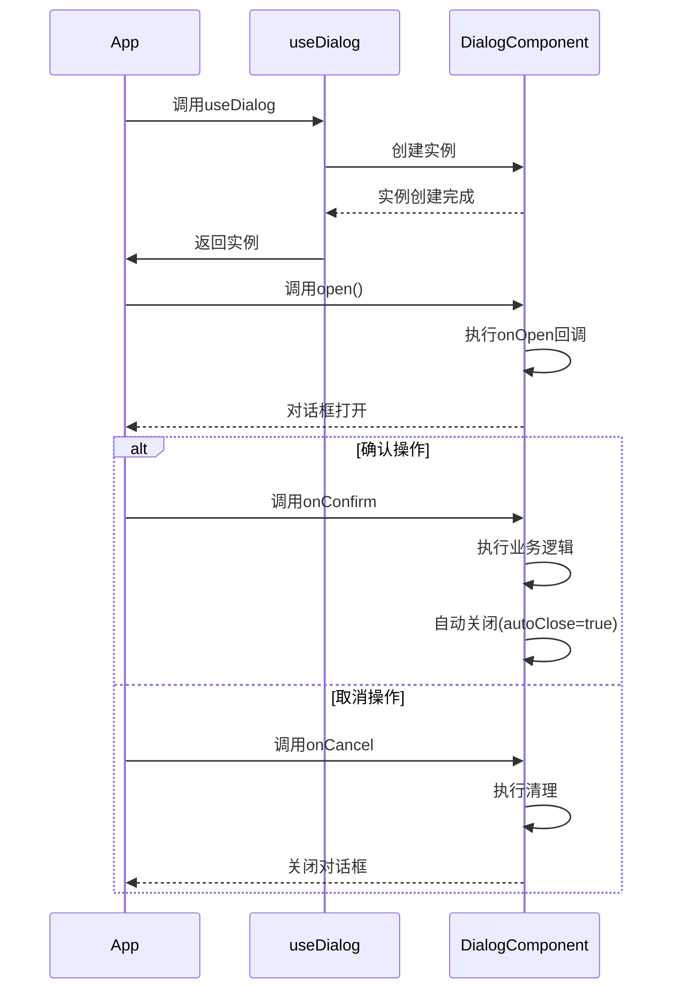

# useDialog 对话框管理钩子

## 功能说明
提供统一的对话框管理，支持动态组件加载和异步操作处理

## 核心特性
- 🚀 动态组件加载
- ⏳ 异步组件支持
- 🛠️ 自定义布局
- 🔄 响应式配置
- 🛡️ 错误边界处理

## 参数配置 (DialogInstance)
| 参数名               | 类型                          | 默认值      | 说明                          |
|----------------------|-------------------------------|-------------|-----------------------------|
| title                | string \| TranslateResult     | -           | 对话框标题                   |
| area                 | number[] \| number \| string  | -           | 对话框尺寸                   |
| areaUnit             | 'rem' \| 'px' \| 'vw' \| 'vh' | 'px'        | 尺寸单位                     |
| confirmText          | string \| TranslateResult     | '确认'      | 确认按钮文字                 |
| cancelText           | string                        | '取消'      | 取消按钮文字                 |
| customClass          | string                        | -           | 自定义类名                   |
| isAsync              | boolean                       | false       | 是否异步                     |
| isInitRequest        | boolean                       | false       | 是否初始化请求               |
| request              | any                           | -           | 请求参数                     |
| component            | Component \| JSX.Element      | -           | 对话框内容组件               |
| compData             | any                           | -           | 对话框内容数据               |
| showFooter           | boolean                       | true        | 是否显示底部操作栏           |
| modal                | boolean                       | true        | 是否模态对话框               |
| isFullScreen         | boolean                       | false       | 是否全屏                     |
| separationCancelClose | boolean                       | false       | 是否分离取消关闭             |
| contentText          | string \| TranslateResult     | -           | 对话框内容文字               |
| confirmBtnType       | 'danger'                      | -           | 危险操作按钮类型             |
| timingBtn            | boolean                       | false       | 是否显示计时按钮             |
| btn                  | string \| boolean \| TranslateResult \| Array<TranslateResult \| string> | -           | 按钮配置                     |
| close                | () => void                    | -           | 关闭回调                     |
| open                 | () => void                    | -           | 打开回调                     |
| onOpen               | (instance: any) => void        | -           | 打开回调                     |
| onConfirm            | (instance: any) => boolean \| Promise<boolean \| void> \| void | -           | 确认回调                     |
| onCancel             | (instance: any) => void        | -           | 取消回调                     |
| cancel               | () => void                    | -           | 取消回调                     |
| autoClose            | boolean                       | true        | 自动关闭                     |


## 核心方法
```typescript
interface DialogInstance {
  // 打开对话框
  open: () => void
  
  // 关闭对话框
  close: () => void
  
}
```

## 使用示例
### 基础对话框
```typescript
const openDialog = async () => {
  const dialog = await useDialog({
    title: '用户信息',
    area: [600, 400],
    component: UserInfoForm,
    onConfirm: (instance) => {
      // 处理确认逻辑
      instance.close()
    }
  })
}
```

### 异步组件加载
```typescript
const openAsyncDialog = async () => {
  const dialog = await useDialog({
    title: '加载中...',
    component: () => import('./AsyncComponent.vue'),
    isAsync: true
  })
}
```

### 危险操作确认
```typescript
const confirmDelete = async () => {
  try {
    await useDialog({
      title: '危险操作',
      confirmBtnType: 'danger',
      contentText: '确认要删除吗？此操作不可逆！',
      onConfirm: () => {
        // 执行删除操作
      }
    })
  } catch {
    // 取消操作
  }
}
```

## 生命周期


## 最佳实践
1. 复杂内容使用异步组件加载
2. 危险操作使用确认对话框
3. 保持对话框职责单一
4. 及时清理对话框实例
5. 移动端适配弹性布局

## 注意事项
1. 需要配合bt-dialog组件使用
2. 异步组件需处理加载状态
3. 避免在循环中创建实例
4. 及时处理内存泄漏
5. 复杂交互需考虑状态管理 