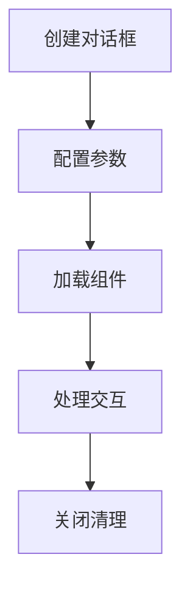
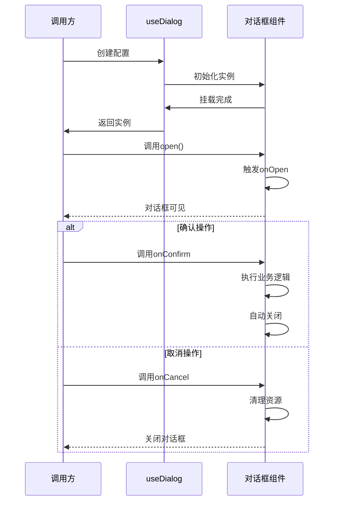

# useDialog 对话框管理钩子

## 核心功能


## 参数配置
| 参数名               | 类型                          | 必填 | 默认值      | 验证规则                     |
|----------------------|-------------------------------|------|-------------|-----------------------------|
| `title`              | string \| boolean             | 是   | -           | 长度2-32字符，禁用特殊符号    |
| `area`               | string[] \| number[] \| string \| number | 是 | - | 有效格式：['500px', 300] 或 '80%' |
| `component`          | string \| Component \| JSX.Element | 是 | - | 必须为有效Vue组件/组件路径     |
| `onConfirm`          | (App) => boolean \| void      | 是   | -           | 必须返回boolean             |
| `onCancel`           | (App) => boolean \| void      | 是   | -           | 必须处理清理逻辑            |
| `modal`              | boolean                       | 否   | true        | 是否显示遮罩层                |
| `compData`           | any                           | 否   | -           | 传递给组件的响应式数据        |
| `fullscreen`         | boolean                       | 否   | false       | 是否全屏                      |
| `draggable`          | boolean                       | 否   | false       | 是否可拖拽                    |
| `footer`             | boolean                       | 否   | true        | 是否显示底部操作栏            |
| `zIndex`             | number                        | 否   | 2000        | 层级控制（2000-9999）         |
| `customClass`        | string                        | 否   | -           | 自定义类名                    |
| `closeBtn`           | 'one' \| 'two'                | 否   | 'one'       | 关闭按钮样式                  |
| `cancelText`         | string                        | 否   | '取消'      | 取消按钮文字（长度≤4）        |
| `confirmText`        | string                        | 否   | '确认'      | 确认按钮文字（长度≤4）        |


## 使用示例
### 基础对话框
```typescript
const dialog = await useDialog({
  title: '用户编辑',
  area: ['600px', '400px'],
  component: UserEditForm,
  onConfirm: (instance) => {
    if(validateForm()) {
      instance.close()
      return true
    }
    return false
  },
  onCancel: (instance) => {
    resetForm()
    instance.close()
  }
})
```

### 全屏数据表格
```typescript
const tableDialog = await useDialog({
  title: '全屏数据预览',
  area: '100%',
  component: DataTable,
  compData: { rows: data.value },
  fullscreen: true,
  draggable: false,
  zIndex: 3000
})
```

## 生命周期控制


## 最佳实践
1. **组件规范**
```typescript
// 对话框内容组件需实现以下接口
interface DialogComponent {
  open: () => void          // 打开回调
  close: () => void         // 关闭回调
  validate?: () => boolean // 可选验证方法
}
```

2. **内存管理**
```typescript
// 在onUnmounted钩子中清理
onUnmounted(() => {
  dialogInstances.forEach(instance => {
    instance.close()
    instance = null
  })
})
```

3. **性能优化**
```typescript
// 大数据使用shallowRef
const bigData = shallowRef(largeDataSet)

// 异步组件加载状态
const asyncComponent = defineAsyncComponent({
  loader: () => import('./HeavyComponent.vue'),
  loadingComponent: LoadingSpinner,
  delay: 200
})
```

## 错误代码表
| 代码   | 类型         | 处理建议                   |
|--------|--------------|----------------------------|
| DLG-01 | 参数缺失     | 检查必填参数完整性         |
| DLG-02 | 组件无效     | 验证组件路径/导出格式      |
| DLG-03 | 尺寸非法     | 使用有效尺寸格式           |
| DLG-04 | 层级冲突     | 调整zIndex(2000-9999)     |
| DLG-05 | 内存泄漏     | 检查实例清理逻辑           | 