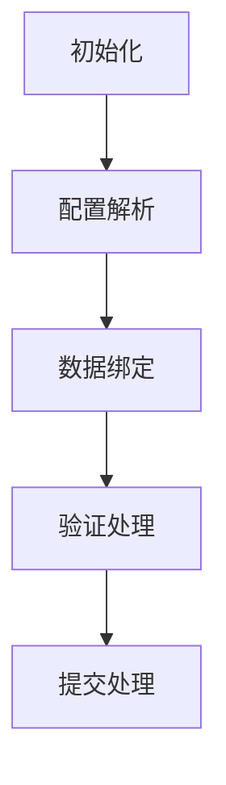

# useForm 表单管理钩子

## 功能架构


## 核心类型
```typescript
// 表单基础配置
type FormBaseItemProps = 
  | FormInputProps    // 输入框
  | FormSelectProps   // 选择框
  | FormCheckboxProps // 复选框
  | FormRadioProps    // 单选框
  | FormSwitchProps   // 开关
  | FormHelperProps   // 帮助说明

// 完整表单项类型
type FormItemProps = 
  | FormGroupItemProps  // 组合项
  | FromCustomProps     // 自定义项
  | FormButtonProps     // 按钮
  | FormSlotsProps      // 插槽
```

## 表单项配置
### 通用参数
| 参数名       | 类型          | 必填 | 说明                |
|--------------|---------------|------|---------------------|
| `type`       | string        | 是   | 组件类型标识         |
| `label`      | string        | 是   | 表单项标签          |
| `key`        | string/object | 是   | 数据键/嵌套键配置    |
| `attrs`      | object        | 否   | 组件原生属性        |
| `rules`      | FormRules     | 否   | 验证规则           |
| `slots`      | object        | 否   | 插槽配置           |

### 组件特定参数
| 组件类型       | 特有参数                | 类型                          |
|----------------|-------------------------|-------------------------------|
| `select`       | options                | SelectOptionProps[]/function  |
| `checkbox`     | options                | CheckboxOptionsProps[]/function |
| `radio`        | options                | RadioOptionsProps[]/function  |
| `help`         | options                | HelpOptionsProps[]            |
| `group`        | group                  | FormItemProps[]               |
| `custom`       | render                 | (formData) => JSX.Element     |

## 核心方法
```typescript
interface UseFormReturn {
  // 表单组件
  BtForm: VueComponent
  
  // 清除验证状态
  clearValidate: () => void
  
  // 执行表单验证
  validate: () => Promise<boolean>
  
  // 表单数据引用
  param: Ref<AnyObject>
  
  // 表单实例引用
  ref: Ref<FormInstance>
  
  // 提交处理
  submit: () => Promise<void | boolean>
}
```

## 使用示例
### 基础表单
```typescript
const { BtForm, validate } = useForm({
  options: [
    FormInput('用户名', 'username', {
      rules: { required: true }
    }),
    FormSelect('城市', 'city', [
      { label: '北京', value: 1 },
      { label: '上海', value: 2 }
    ])
  ],
  submit: async (data) => {
    return api.submit(data)
  }
})
```

### 复杂表单
```typescript
const complexForm = useForm({
  options: [
    FormGroup([
      FormInput('姓名', 'name'),
      FormInput('年龄', 'age', {
        attrs: { type: 'number' }
      })
    ]),
    FormCustom('自定义区块', () => (
      <div class="custom-section">
        <span>自定义内容</span>
      </div>
    ))
  ]
})
```

## 验证规则配置
```typescript
// 使用ElForm验证规则
const rules = {
  username: [
    { required: true, message: '必填项' },
    { min: 6, message: '至少6个字符' }
  ],
  email: [
    { type: 'email', message: '邮箱格式错误' }
  ]
}

// 应用到表单项
FormInput('邮箱', 'email', {
  rules: rules.email
})
```

## 最佳实践
1. **复杂结构处理**
```typescript
// 嵌套数据结构
FormInput('详细地址', 'address.detail', {
  key: { 'address.detail': '' } // 嵌套键配置
})

// 数组数据
FormCheckbox('兴趣', 'hobbies[]', [
  { label: '阅读', value: 1 },
  { label: '运动', value: 2 }
])
```

2. **动态表单**
```typescript
const dynamicOptions = ref([
  FormInput('动态字段', 'dynamicField')
])

watch(someCondition, (newVal) => {
  dynamicOptions.value = newVal ? 
    [/* 条件成立时的配置 */] : 
    [/* 默认配置 */]
})
```

3. **性能优化**
```typescript
// 大数据使用shallowRef
const largeData = shallowRef(bigDataSet)

// 异步加载配置
const asyncOptions = computedAsync(async () => {
  const res = await fetchOptions()
  return res.map(item => FormInput(item.name, item.key))
})
```

## 错误处理
| 错误代码 | 类型         | 处理方案                 |
|----------|--------------|--------------------------|
| FORM-01  | 配置缺失     | 检查必填参数完整性       |
| FORM-02  | 键值冲突     | 验证key的唯一性         |
| FORM-03  | 验证失败     | 检查rules配置           |
| FORM-04  | 数据格式错误 | 验证数据结构匹配配置    |
| FORM-05  | 提交异常     | 添加try/catch处理       | 